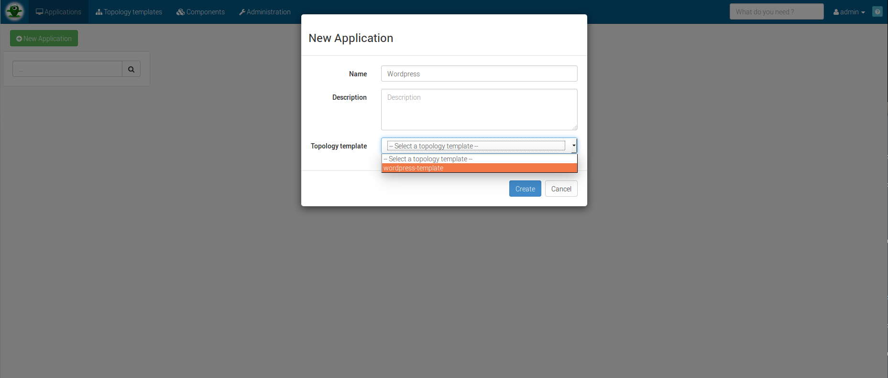
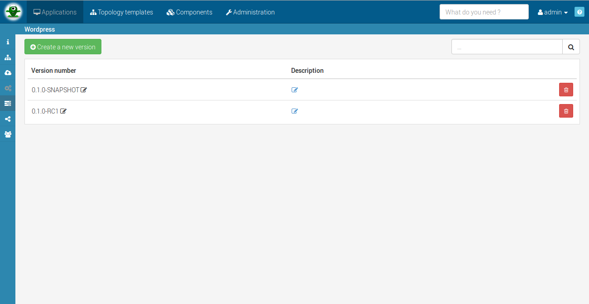
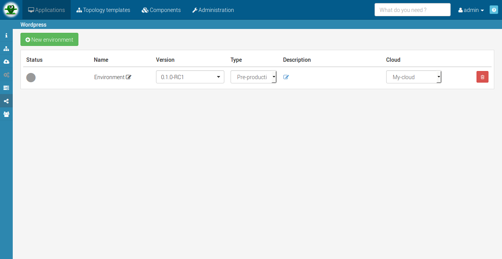
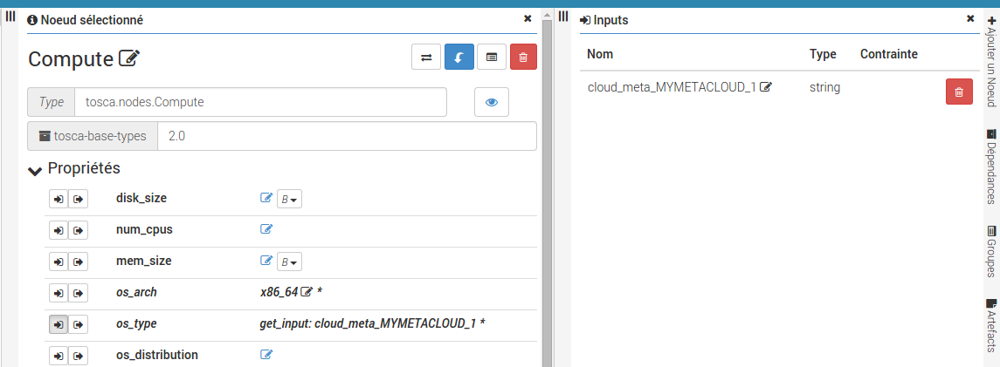




To understand the application concept, please refer to [this section](#/documentation/concepts/applications.html).


# Create new application

To create an application, go in the *application* list page and click on the *New application*
button. You can directly create an application from a topology template if you have one.

# Configure versions

In the *version* page you can create, edit or delete a version. As we already say in the application concept page, if you remove the 'SNAPSHOT' qualifier, your version will be released and the associated topology not editable.

# Configure environments

In the *environment* management page you can create, edit or delete an environment. The version and the cloud are the most important informations.


An environment cannot be deleted when it's application is still deploy.


# Manage roles

## Application's roles

These roles defines actions allowed by *role* on a given application :

{: .table .table-bordered}
| Role | Description |
|:---------|:------------|
| APPLICATION_MANAGER | Application manager can manage the application configuration, it's versions and environments as well as user management for the application. |
| APPLICATION_DEVOPS | Dev ops role should be given to the applications developer. In ALIEN users with devops role on an application can edit the topologies of every SNAPSHOT versions. |

In addition to the applications roles, Application manager can specify some roles related to every single environment defined for the application.

## Environment's roles

These roles defines actions allowed by *role* on a given environment :

{: .table .table-bordered}
| Role | Description |
|:---------|:------------|
| APPLICATION_USER  | An application user on an environment is allowed to see the environment status as well as having access to the deployment output properties (URL for example so he can directly reach the deployed application). |
| DEPLOYMENT_MANAGER   | Deployment manager for an environment is responsible for configuration and deployment/undeployment of an environment. In order to be able to deploy/undeply the environment the user must also have a CLOUD_DEPLOYER role on the cloud that is associated with the environment. CLOUD_DEPLOYER role is configured on the cloud configuration by any user having the global ADMIN role. |

# Advanced inputs

This section describe how you can use internal variables defined in __cloud__, __application__ or __environment__. Those parameters
could be used as inputs for nodetemplate properties.

Our target for this feature is to allow internal prefixes to target meta-properties over different elements :

{: .table .table-bordered}
| Targeted element | Implemented Internal prefix | Incoming Internal prefix | Description |
|:------------|:-----------|:------------|:------------|
|*cloud*      | `cloud_meta_` | cloud_tags_ | Target *meta-properties* or *tags* defined on a cloud |
|*application*| `app_meta_` , `app_tags_` |           | Target *meta-properties* or *tags* defined on an application |
|*environment*|   | env_meta_ , env_tags_| Target *meta-properties* or *tags* defined on an environment  |


<h5>Internal input prefixes</h5>
This list could change regarding A4C user needs and use cases.


## Define a property as an internal input

When you define a topology, you may want to define some node properties as inputs. An input is
by default a value required to the user in order complete the topology and deploy.

 

You can define any property as input and then set its value in the deployment page or indicate
that the input is using a internal variable defined on *cloud*, *application* or *environment* for example.

Here, in our example let's say that we want to use one of the meta property defined on our cloud instance :

- **MYMETACLOUD_1**
- **MYMETACLOUD_2**

 

The way to do that is to prefix the cloud meta property name by one of the internal prefixes define above
and give the good name to have the good targeted value :

- `cloud_meta_`**MYMETACLOUD_1**
- `cloud_meta_`**MYMETACLOUD_2**

If you have some tags or meta-properties defined on your application, same syntax :

- `app_tags_`**MYAPP_TAG1**
- `app_tags_`**MYAPP_TAG2**
- `app_meta_`**MYAPP_META1**
- `app_meta_`**MYAPP_META2**


<h5>Meta property naming</h5>
**Note :** avoid dot __.__ caracter in you meta-property name (e.g. my.meta.1)



<h5>Missing values</h5>
We have two possible cases regarding an input and the targeted meta-property :

- **requirted** property : if the provided value doesn't exist as input the property will stay marked as __missing__ and the topology not deployable
- **optional** property : if the provided value doesn't exist you will have a `warning` but the deployment will still be possible


In fact, the deploying page will handle *warnings* and *tasks* list to help you in having a good deployment setup.
