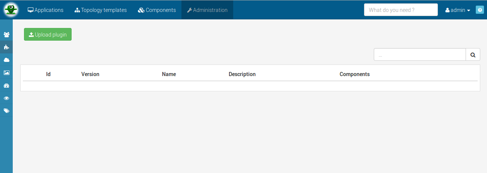
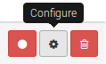

Plugins provides some additional functionalities to Alien 4 Cloud. We currently support paas provider plugins (orchestrators interface with Alien 4 Cloud) but aims to provide much more plugins with various functionalities and even UI components.

# PaaS Providers (Orchestrators)

Alien 4 Cloud is not managing actual runtime state of deployments by itself. In order to do so it delegates runtime to orchestrators, as well refered in Alien 4 Cloud as _PaaS Providers_. A PaaS Provider in A4C is a plugin that will be associated with _Clouds_. It is possible of course to have multiple clouds using the same PaaS Provider as well a multiple clouds with different PaaS Providers.

We currently support Cloudify 2 and Cloudify 3 orchestrators as PaaS Providers. Cloudify 3 is recommended for new projects while we still recommends using Cloudify 2 as long as the version 3.2 is not released and supported in Alien 4 Cloud.

## Installing plugin in Alien 4 Cloud




*Drag* you archive file > *Drop* it on the **dash dotted** area




Click on *[Upload plugin]* > *Select* your archive (The file is automaticly uploaded)




## Plugin configuration

Some plugins may requires specific configuration that is global to the plugin. In case a plugin can be configured you will see the following icon : {: .inline}

### Advanced plugins configurations

The configuration detailed in the previous section is global for the plugin. Some plugins may requires some specific configurations that you can find at other places in the application. Your should refer to the plugin specific documentation to know more about it.

For example, PaaS providers plugins actually are able to manage multiple instances of orchestrators, the specific configuration for each instance is managed at the cloud level.

## Plugin creation

If you want to create new plugins for Alien 4 Cloud please refer to the [developer guide](#/developer_guide/index.html).
