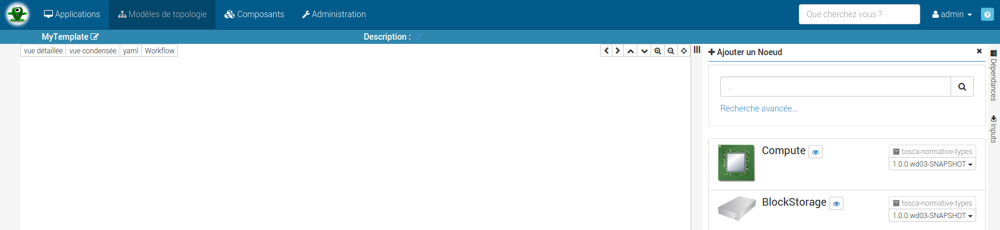
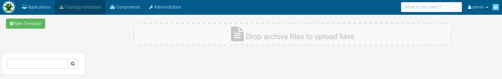
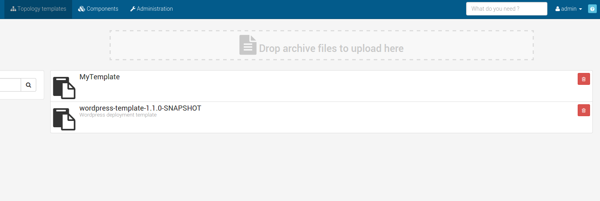



# Topology

To understand the topology concept, please refer to [this section](#/documentation/concepts/topologies.html).

# Topology template

A topology template allows you to create an application structure which we may use
for a real application root.

You can access to this feature on menu `Topology templates` and start to create
a new template with the topology composer or upload a zip file with your template.





Create a new topology {: .inline} giving at least a
`template name` and if you want a `description`.


This template name will identify your template and must be unique.


And then compose your template in this view :




Just drag and drop your zipped topology in the upload area :





# Topology templates list

Once you have created / uploaded a template you should be able to see it in the template list :

From now you can use any template when [creating a new application](#/documentation/user_guide/application_management.html).
